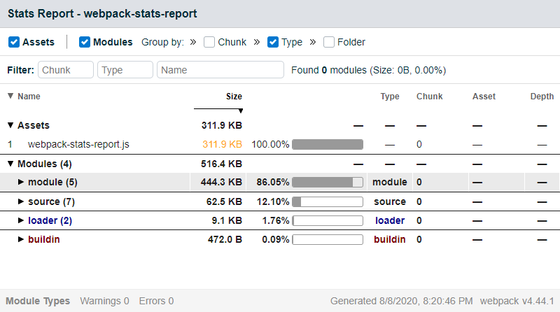

# webpack-stats-report
> Generation report for webpack stats.



## Install
```sh
npm i webpack-stats-report --save-dev
```
## Usage

### As a webpack plugin
```js
// webpack.config.js
const StatsReportPlugin = require("webpack-stats-report").StatsReportPlugin;
module.exports = {
    // ... configuration settings here ...
    plugins: [new StatsReportPlugin({ 
        //options
        title: "Stats Report - webpack-stats-report",
        output: ".temp/stats-report.html"
    })]
};
```

### As a Node API
```js
const webpack = require('webpack');
const StatsReportGenerator = require("webpack-stats-report").StatsReportGenerator;
webpack(webpackConfig, (err, stats) => {
    StatsReportGenerator({
        //options
        title: "Stats Report - webpack-stats-report",
        output: ".temp/stats-report.html"
        //require one more option stats
        stats: stats.toJson(toJsonOptions)
    });
});
```

## Options
```js
//default options
{
    title: "Stats Report",
    output: "stats-report.html",
    outputStatsJson: false,
    toJsonOptions: {
        reasons: false,
        chunkModules: false,
        source: false
    },
    colorConditions: {
        redSizeGT: 500 * 1024,
        orangeSizeGT: 200 * 1024,
        redNameNotIncludes: []
    }
}
```

## Changelog

* v1.0.0